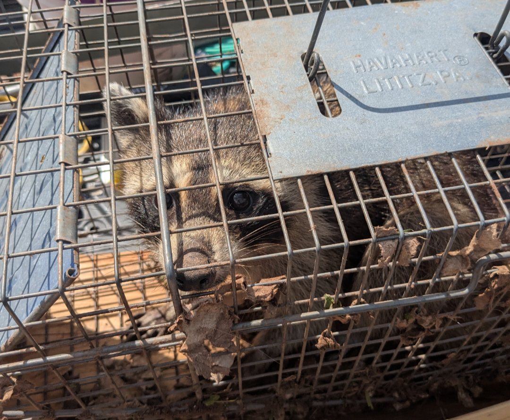

# Connecticut Nuisance Wildlife Control as a Community Service

## LinkedIn Summary

Since 2008, I have maintained my license as a Nuisance Wildlife Control Operator in Connecticut.

It is a small part of my overall workload, but I continue to keep the license active because the work serves a practical need in the community. People often reach out when wildlife has entered a home, garage, attic, crawlspace, outbuilding, or another part of their property and they are unsure what to do next.

In those situations, the value is not limited to addressing the immediate problem. It is also about bringing a calm, structured response to something that can be stressful for a property owner. The process starts with listening to what they have observed, inspecting the conditions, identifying likely activity and access points, explaining the available next steps, and completing the work within Connecticut's requirements for licensed operators.

My construction background is useful in this work. Understanding how buildings are assembled helps me evaluate rooflines, foundations, decks, garages, exterior openings, and other conditions that may allow wildlife to enter or remain around a structure. It also helps connect the immediate response with practical repairs or preventive work that may be needed afterward.

Maintaining the license also carries responsibilities beyond the fieldwork, including accurate records, state reporting, and continued accountability for the services provided.

Nuisance wildlife control is not a service I pursue for scale, but at times it is some of the most enjoyable work I do. The outcome is direct: someone in the community has a problem they do not know how to handle, and I can use experience, patience, and practical fieldwork to help them move forward.

That sense of usefulness is why I have continued doing it for nearly two decades.

#NuisanceWildlifeControl #Connecticut #CommunityService #PropertyCare #FieldWork

## Overview

Daniel Powell has maintained a Connecticut Nuisance Wildlife Control Operator license since 2008. The work represents a small part of his overall workload, but it has remained active because it provides a direct service to people who may not know how to respond when wildlife enters or begins using part of a home, accessory structure, or surrounding property.

The role combines field observation, property inspection, practical communication, building knowledge, documentation, and responsible follow-through. It is not presented as a large operation or a primary business line. Its continuing value is local and personal: helping a property owner understand the situation, identify a reasonable path forward, and address the conditions within the scope of a licensed Connecticut operator.

| Record field | Public information |
|---|---|
| Public record ID | PUB-0010 |
| Period | 2008-present |
| General location | Connecticut |
| Credential | Connecticut Nuisance Wildlife Control Operator license |
| Role | Licensed operator and field-service provider |
| Service context | Residential properties, accessory structures, and surrounding property conditions |
| Current status | Continuing credential and limited active service |
| Evidence basis | Direct operator confirmation, archived credential records, state-reporting activity, and current private field records |

## Role

Daniel responds when a property owner needs help understanding and addressing nuisance-wildlife activity. The first responsibility is to bring structure to a situation that can be unfamiliar or stressful. That means listening carefully to what the owner has observed, inspecting the relevant conditions, evaluating likely activity and access, explaining the available next steps, and completing appropriate work within the requirements that apply to licensed operators in Connecticut.

The role also includes setting realistic expectations. Wildlife activity around a structure is not always limited to one visible event. The property conditions, the way a building is assembled, the location of openings, and the surrounding environment can all influence what is occurring. A useful response therefore considers both the immediate concern and the conditions that may need attention afterward.

## Scope Of Work

The continuing service includes:

- Receiving and clarifying reports from property owners.
- Reviewing the area where activity has been observed.
- Inspecting relevant interior and exterior building conditions.
- Evaluating likely access points and patterns of activity.
- Explaining practical next steps in plain language.
- Performing work allowed within the operator's credential and the applicable requirements.
- Maintaining records associated with the service.
- Completing required state reporting and credential administration.
- Identifying property conditions that may warrant repair, exclusion, maintenance, or monitoring by the appropriate party.
- Following up when the situation requires additional observation or coordination.

The exact response varies by property and circumstance. This public record intentionally does not provide animal-specific procedures, equipment details, private case information, or instructions that could be mistaken for universal guidance.

## Community Purpose

Many property owners have experience with routine maintenance but little experience responding to wildlife inside or around a structure. When an unexpected situation occurs, it can be difficult to distinguish an urgent concern from a condition that can be handled through a measured process. People may also be uncertain about what they are permitted to do, whom they should contact, or what part of the property needs to be examined.

Maintaining the NWCO license allows Daniel to provide a practical point of contact for those situations. The service is intentionally kept available even though it is not a central part of his business. The reason is straightforward: it meets a real local need, and the result is directly useful to the person asking for help.

This type of work can be particularly satisfying because the connection between effort and outcome is clear. A property owner begins with uncertainty. Through inspection, explanation, fieldwork, and follow-through, the situation becomes more understandable and manageable.

## Construction Knowledge In Wildlife Work

Daniel's background in residential and commercial construction supports the inspection side of nuisance-wildlife work. Buildings are systems, and wildlife access often relates to how those systems meet: roof edges, exterior openings, foundations, attached structures, decks, garages, utility penetrations, and transitions between materials.

Construction experience helps with reading those conditions in context. It provides an understanding of what is structural, what is finish material, which areas may conceal a route into the building, what can be inspected safely, and when another qualified trade should be involved. It also supports clearer communication about repairs or preventive work that may be appropriate after the immediate concern has been addressed.

This does not turn every wildlife call into a construction project. It means the field assessment benefits from practical knowledge of how the property was built and how its components interact.

## Field Process

A typical engagement begins with an owner describing what they have seen, heard, or found. That information provides a starting point, but the field inspection is used to establish a more complete understanding of the conditions.

The inspection may consider the reported area, adjacent spaces, visible access conditions, signs of continued activity, and features of the structure or property that are relevant to the concern. Daniel then explains the situation in practical terms, outlines the next steps available within the assignment, and identifies any related work that should be handled separately.

The process is deliberately evidence-based. Observations are separated from assumptions, and property-specific conclusions are not generalized beyond the conditions actually reviewed. When a situation falls outside the role or requires another authority or specialist, the response should make that boundary clear.

## Key Actions

- Maintained the Connecticut NWCO credential over a long operating period.
- Continued providing limited local service alongside construction, drafting, project, and technology work.
- Applied a calm and structured intake process to unfamiliar property-owner concerns.
- Combined field observations with practical knowledge of building assemblies.
- Evaluated immediate activity together with relevant access and property conditions.
- Communicated findings and next steps in terms a property owner could use.
- Maintained the records and reporting associated with the licensed activity.
- Kept individual clients, properties, and case details confidential.
- Treated each assignment as a distinct field condition rather than relying on one standard response.

## Important Features

- Active Connecticut professional credential.
- Service history beginning in 2008.
- Direct assistance to local property owners.
- Residential and accessory-structure inspection experience.
- Construction-informed understanding of building access conditions.
- Practical communication during stressful or unfamiliar situations.
- Documentation and state-reporting discipline.
- Clear boundaries between field observations, recommendations, and work requiring another specialist.
- Continued availability despite the service remaining a small part of Daniel's workload.

## Documentation And Accountability

The work continues after the visible field task. Maintaining a Connecticut NWCO license includes administrative responsibilities, recordkeeping, and reporting. Those obligations create continuity between individual assignments and the state's licensed-operator framework.

Daniel maintains the credential because the accountability is part of providing the service responsibly. Private records may contain client information, property details, observations, and case documentation, but none of that material is transferred directly into this public archive. This record is a sanitized description of the role and its operating purpose.

## Constraints And Decisions

Nuisance-wildlife work involves property conditions, living animals, public-safety considerations, and state requirements. Each situation must be evaluated on its own facts. This archive therefore avoids presenting a generic procedure or implying that one response is suitable for every property.

The work is also bounded by the operator's credential, the circumstances observed, and the responsibilities of other parties. Building repair, environmental conditions, animal control, emergency response, and specialized trade work may require separate coordination. A responsible assessment includes recognizing those boundaries.

For privacy, the public record excludes license identifiers, client names, addresses, internal job numbers, case dates, animal-specific details, methods, photographs, property measurements, pricing, and financial information. The location remains generalized to Connecticut.

## Deliverables

Depending on the assignment, the useful outputs may include:

- A documented understanding of the reported concern.
- An inspection of relevant property and building conditions.
- A practical explanation of observations and likely access conditions.
- Field service within the operator's licensed scope.
- Recommendations for monitoring, maintenance, repair, or additional professional involvement.
- Follow-up communication as appropriate to the situation.
- Private records supporting accountability and state reporting.

The central deliverable is clarity: the property owner receives a structured response and a more informed path forward.

## Outcome

Daniel has kept nuisance-wildlife control as a continuing community-facing service for nearly two decades. It remains a limited portion of his work, but one with a clear and immediate purpose.

The value comes from combining patient communication, field judgment, building knowledge, and a maintained professional credential. For property owners, that means access to someone who can evaluate the conditions, explain what is known, and help move the situation toward an appropriate resolution. For Daniel, it provides a form of work in which the benefit to the community is direct and visible.

That practical usefulness is the reason the credential and service have remained active since 2008.

## Tools And Methods

- Property-owner intake and observation review
- Interior and exterior condition assessment
- Construction-informed building inspection
- Photographic and written field documentation kept in private records
- Activity and access-condition evaluation
- Plain-language explanation of findings
- Licensed field-service practices
- Follow-up and referral coordination when appropriate
- Administrative recordkeeping
- Connecticut state reporting
- Privacy-conscious public documentation

## Evidence And Limitations

This record is based on Daniel's direct account of obtaining the Connecticut NWCO credential in 2008 and continuing to maintain it, archived resume material that records the credential, a private note documenting state reporting, and current private field-service records. The [Connecticut DEEP license application](https://portal.ct.gov/-/media/DEEP/wildlife/pdf_files/nwco/NWCOApppdf.pdf) confirms that Nuisance Wildlife Control Operator is the state's formal license title.

The expanded record describes a continuing category of work, not one identifiable assignment. It does not disclose the license number, clients, addresses, internal job identifiers, contact information, animals involved, response methods, equipment, case outcomes, property measurements, or commercial information.

Statements about enjoyment, usefulness, and community value reflect Daniel's own assessment of the work. This record does not provide legal, regulatory, wildlife-handling, or public-safety instructions. Property owners should use current official guidance and appropriately licensed professionals for their own circumstances.
